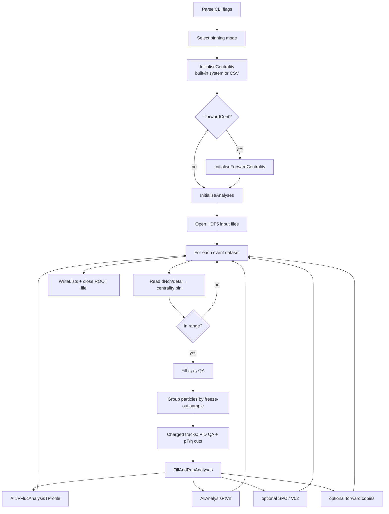

# JCORRAN Library
Contact: Maxim Virta <maxim.virta@cern.ch>, DongJo Kim <dongjo.kim@cern.ch>

Jyvaskyla Correlation analysis library package for Linux and macOS systems.

Recent papers to produce the results:
- Phys.Lett.B 835 (2022) 137485: New constraints for QCD matter from improved Bayesian parameter estimation in heavy-ion collisions at LHC
- arXiv:2411.01932: Enhancing Bayesian parameter estimation by adapting to multiple energy scales in RHIC and LHC heavy-ion collisions

## Requirements

- ROOT framework (https://root.cern.ch/) must be installed and properly configured
- C++ compiler (g++ recommended)

## Installation

1. Clone this repository
2. Add the "bin"-folder to your PATH environment variable (see below)
3. Run `createJCORRANlib` to build the library

### Adding bin-folder to PATH

For Linux and macOS, add the following line to your shell profile file (`.bashrc`, `.zshrc`, etc.):

```bash
export PATH="/absolute/path/to/JCORRAN/bin:$PATH"
```

Then reload your profile with: 

For bash:
```bash
source ~/.bashrc
```

For zsh:
```bash
source ~/.zshrc
```

# Commands
`jcorran-config-path` outputs the path to JCORRAN folder.

`jcorran-config-lib` outputs the lib flags required for linking.

`jcorran-config-inc` outputs the cxx flags required for compiling.

## Examples

Two example drivers live in `Example_JCorran/`:

- **`main`** — synthetic event demo (no external input files)
- **`main_hdf5`** — production-style driver reading HDF5 hydro particle files

Build both (requires HDF5 for `main_hdf5`):

```bash
cd Example_JCorran
make
```

Run the synthetic demo:

```bash
./main --nEvents 100 -o AnalysisResults.root
```

Run the HDF5 driver:

```bash
./main_hdf5 -o AnalysisResults.root --system PbPb5020 --param 0 input.hdf
```

For custom centrality tables, pass a CSV path to `--system` and select the parametrization line with `--param`. Sample CSV files are in `Example_JCorran/dependencies/`.

## Analysis flow (`main_hdf5`)



**Helper functions:** `InitialiseDataTypes` · `InitialiseCentrality` · `InitialiseForwardCentrality` · `InitialiseAnalyses` · `FillAndRunAnalyses`

### pT / η / centrality (where they apply)

| Layer | What | Notes |
|---|---|---|
| Driver gate | `--pTmin/--pTmax`, `--absEtaMax` | Global filter into `pinputList` for all analyses |
| η-gap (not acceptance) | `--absEtaMin`, `--absEtaMaxVnPt` | Subevent geometry via `SetEtaRange` / `SetPtSubRange` (η ranges) |
| JFluc QC | Hardcoded pT 0.2–5.0 | Extra cut inside library |
| Centrality % | From `dNch_deta` (+ forward) | Midrap `cent` passed to all `SetEventCentrality` (as in JCORRAN_analysis); `cent_forward` only for forward QA indexing / event selection |
| Bin edges | Per class `GetBin` / `SelectCentrality` | JFluc & PtVn finer; SPC & V02 use 0–80% wide bins |

See the interactive flowchart canvas (**pT / η / centrality** tab) for the full diagram.